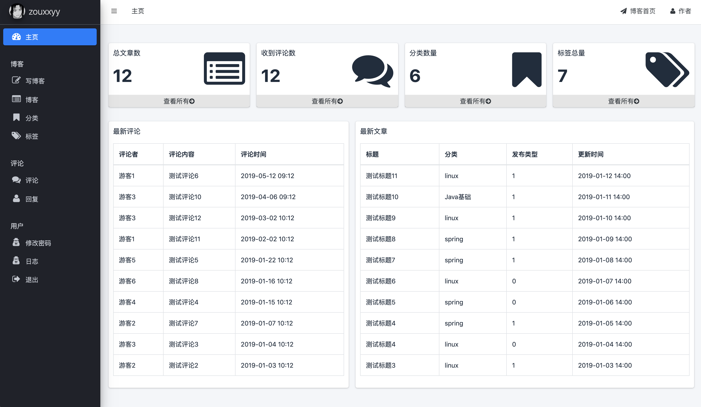
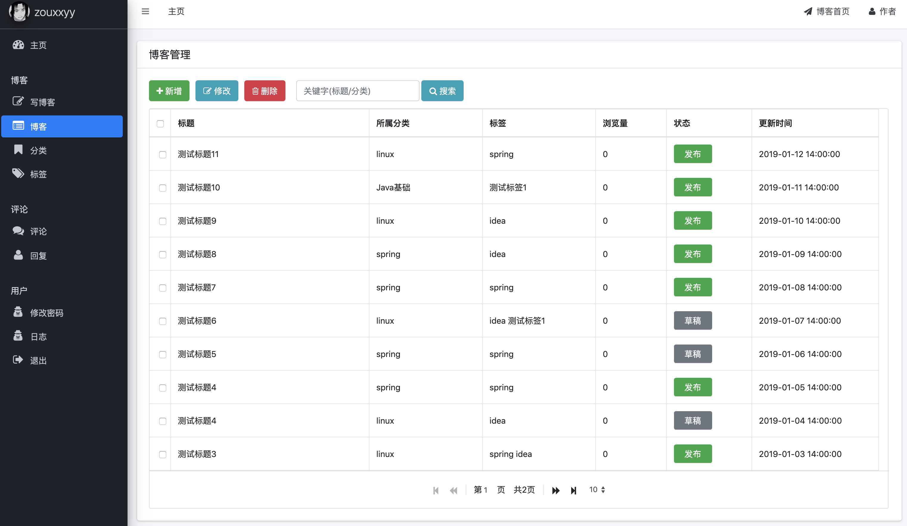
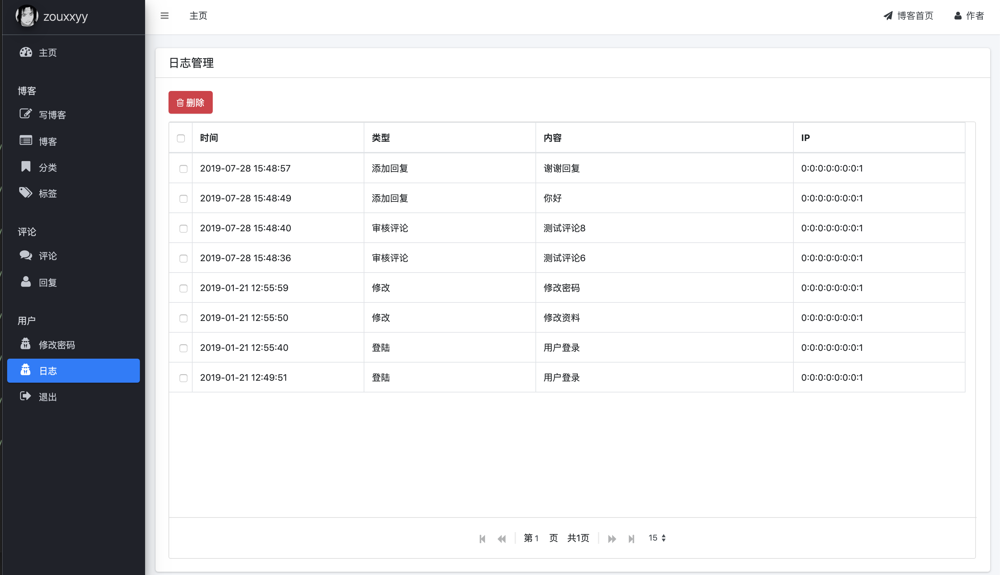

# blog-master

## 简介

一个简单的**博客后台管理系统**，学习自[博客项目](https://github.com/ZHENFENG13/My-Blog)

基本功能包括：管理主页，博客、博客分类、博客标签、评论、日志等等。可以说一个博客的基本需求都满足了。

可以把它当做一个**spingboot的入门实战教程**。（以后争取把它和hexo结合）

需要的技术有：
**springboot + mybatis + thymeleaf + 一些简单的前端知识**

## 体验

- clone项目，导入IDE中，选择maven导入

- 导入数据库文件`files/sql/zxy_blog_db.sql`，修改`application.yml`中数据库的配置。

- 启动`ZxyBlogApplication.java`

- 进入 http://localhost:8081/admin/login ，初始用户名admin，密码123456

## 开发日志

- [day00](https://github.com/Zouxxyy/blog-master/blob/master/files/devlog/day00.md) 项目内容与结构介绍

- [day01](https://github.com/Zouxxyy/blog-master/blob/master/files/devlog/day01.md) 登陆功能设计与界面熟悉

- [day02](https://github.com/Zouxxyy/blog-master/blob/master/files/devlog/day02.md) 博客分类功能设计

- [day03](https://github.com/Zouxxyy/blog-master/blob/master/files/devlog/day03.md) 博客标签功能设计

- [day04](https://github.com/Zouxxyy/blog-master/blob/master/files/devlog/day04.md) 博客文章功能设计

- [day05](https://github.com/Zouxxyy/blog-master/blob/master/files/devlog/day05.md) 博客评论功能设计

- [day06](https://github.com/Zouxxyy/blog-master/blob/master/files/devlog/day06.md) 博客日志功能设计

- [day07](https://github.com/Zouxxyy/blog-master/blob/master/files/devlog/day07.md) 补充功能设计与后记

## 简单展示

- 主页

- 写博客

- 博客管理

- 日志管理

