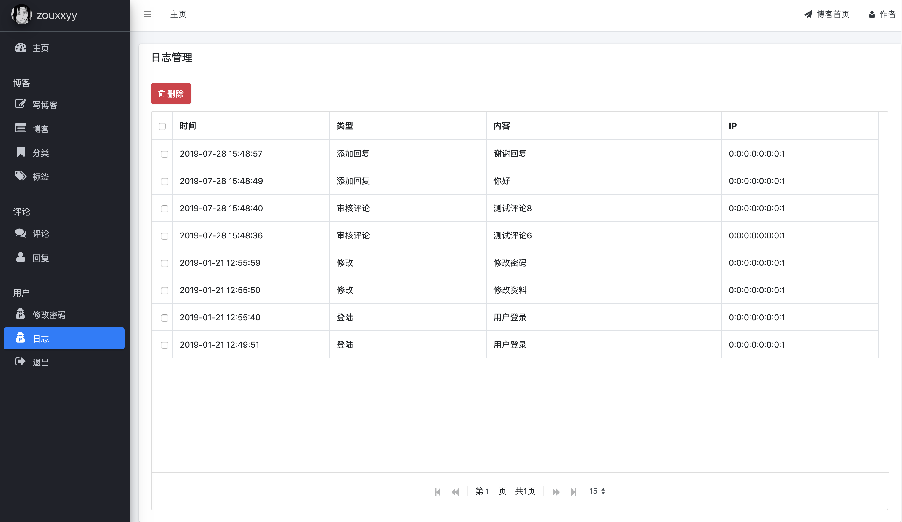

# 第7天

这是管理系统设计的最后一天了，可以看到主要功能已经基本完成。最后再补充点小功能。

## 登陆检查

登陆检查就是添加一个拦截器：访问非登陆页时，检查登陆时存放在session中的数据。如果存在就放行，不存在就跳到登陆界面。这个之所以最后做，因为如果过早添加，调试起来太麻烦。拦截器如下：

```java
// 登陆后台管理页面的拦截器
@Component
public class AdminLoginInterceptor implements HandlerInterceptor {

    @Override
    public boolean preHandle(HttpServletRequest request, HttpServletResponse response, Object o) throws Exception {
        String uri = request.getRequestURI();
        if (uri.startsWith("/admin") && null == request.getSession().getAttribute("loginUserId")) {
            request.getSession().setAttribute("errorMsg", "请重新登陆");
            response.sendRedirect(request.getContextPath() + "/admin/login");
            return false;
        } else {
            request.getSession().removeAttribute("errorMsg");
            return true;
        }
    }
}
```
	
- 注意的是，那些网页静态数据就不要拦截了。
- 然后，安全退出功能就是把session中的数据删除，再回到登陆界面就行。

## 修改密码

就是简单的修改基本信息，以及修改密码功能。这里我添加了一个密码的二次确认。


展示如下：



## 首页设计

设计到这，首页功能应该是小菜一碟了，想添加什么到首页完全又你决定。我添加了各类统计信息，以及最新评论，最新文章。


## 后记

七天之旅终于结束啦。hh，其实不一定是7天了，可以更短或者更长，我只是把每个功能放在一天中写。

至此，博客管理系统基本完成。可以看到，系统配置那一栏还没内容，因为那是一些博客的配置，目前还没写博客的设计。所以，后续就是争取完成与hexo的结合。。猴年马月了。

然后，可以看到，界面还是比较“简洁”的。。。我不是很懂前端，所以就先这样吧。

最后，本来想写个总结，感觉更像教程了，不知道有没有人能看到这里。。。这个过程还是学到了很多，因为说实话，我的mybatis那些操作写的有点乱。写了总结后，自己也更清晰了一点。还有就是，如果你做完，会发现项目中很多都是机械重复的操作，好的说，可以增加码代码熟练度；差的说就是不必在上面花太多时间。hh，不过见仁见智了，因为7天也不算太久啊。

下一个项目见，希望能做的更复杂，更专业一些！

再见～